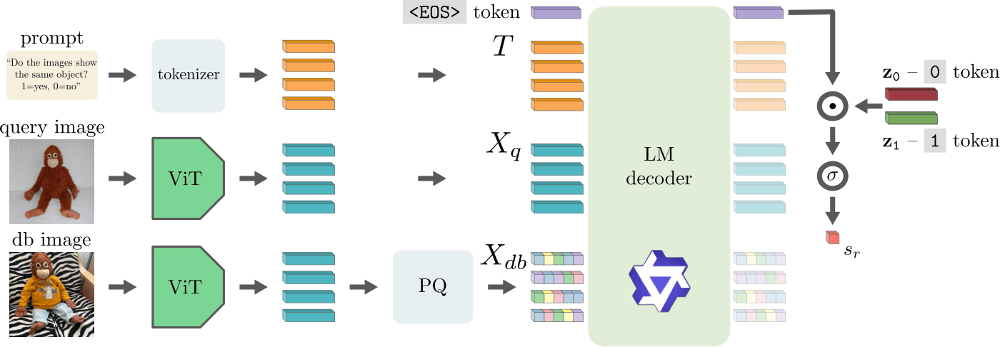

# Indexing Multimodal Language Models for Large-scale Image Retrieval

<div align="center">

**Bahey Tharwat<sup>1</sup>, Giorgos Kordopatis-Zilos<sup>2</sup>, Pavel Suma<sup>2</sup>, Ian Reid<sup>1</sup>, Giorgos Tolias<sup>2</sup>**

<sup>1</sup> Mohamed bin Zayed University of Artificial Intelligence, Abu Dhabi, UAE  
<sup>2</sup> VRG, FEE, Czech Technical University in Prague, Prague, Czech Republic

**CVPR 2026 Findings**

<a href="https://arxiv.org/abs/2604.13268">
  
</a>

</div>

---

# Overview

This repository explores instance-level image retrieval using Multimodal Large Language Models (MLLMs) by indexing and comparing visual representations extracted from vision-language models.

<p align="center">
  
</p>

Given a query image and a candidate database image, our framework uses a multimodal language model, such as Qwen-VL or Intern-VL, to estimate their visual similarity directly. The two images are provided to the model together with a task-specific prompt, and the model’s output probabilities are converted into a similarity score. These scores are then used to rank database images according to their relevance to the query.


The code supports large-scale retrieval experiments and includes utilities for:

* Visual token indexing and compression
* Retrieval and reranking
* Distributed execution on multi-GPU systems
* Evaluation on ILIAS dataset

---

# Dataset Preparation

## ILIAS Dataset

Before running any experiments, download and prepare the **ILIAS** dataset following the instructions from the official repository:

https://github.com/ilias-vrg/ilias

Make sure the dataset paths in your configuration files point to the downloaded dataset locations.

---

# Environment Setup

## Create Environment

```bash
conda create -n mllms python=3.13 -y
conda activate mllms
```

## Install PyTorch

Install a PyTorch version compatible with your CUDA installation.

Example for CUDA 12.8:

```bash
pip install torch==2.8.0 torchvision==0.23.0 torchaudio==2.8.0 --index-url https://download.pytorch.org/whl/cu128
```

## Install Core Dependencies

```bash
pip install \
    transformers==4.53.2 \
    timm \
    xformers \
    faiss-gpu-cu12 \
    triton \
    flash-attn \
    accelerate \
    webdataset \
    h5py \
    numba \
    pyyaml \
    tqdm \
    pillow \
    numpy \
    scipy
```

## Install Additional Packages

### kmeans_pytorch

```bash
pip install -U git+https://github.com/yangnianzu0515/kmeans_pytorch.git
```

### Qwen Utilities

```bash
pip install "qwen-vl-utils[decord]"
```

---

# Running Experiments

## Single GPU

Example:

```bash
python ilias_rerank.py \
    --query_start 0 \
    --query_end 1232 \
    --save_dir ./rerank \
    --output_name results_ilias \
    --config configs/ilias_pe_no_comp.yaml
```

Replace the arguments and config file according to the dataset and experiment you want to run.

---

# Running on Slurm Clusters

For large-scale experiments, queries can be distributed across multiple GPUs.

## Multiple GPUs

Use:

```bash
bash scripts/run_multiple.sh <dataset> <run_name>
```

Example:

```bash
bash scripts/run_multiple.sh ilias ilias_pe_no_comp
```

Requirements:

* A configuration file named:

```text
configs/<run_name>.yaml
```

must exist.

* Results will be written to:

```text
$RESULTS_FOLDER/<run_name>
```

* The script automatically splits the query set across multiple Slurm jobs/GPUs.


---

## Combining Results from Multiple GPUs runs

When running distributed experiments, each job produces a partial JSON file.

Merge all outputs into a single result file using:

```bash
python combine_jsons.py \
    --json_files_dir results/ilias_pe_no_comp \
    --global_similarities similarities_full_i2i_adapt.json \
    --lambda_ensemble 0.5
```

This step should be performed after all Slurm jobs have successfully completed.

---

## Evaluating Combined Results

After combining the partial JSON files, evaluate the merged similarity file using:

```bash
python evaluation/evaluate_ilias.py \
    --dataset_dir /path/to/ilias/images \
    --similarity_file results/ilias_pe_no_comp/results.json
```

Replace `/path/to/ilias/images` with the path to your local ILIAS image directory and update `--similarity_file` to point to the combined JSON file produced in the previous step.

---

# Citation

If you use this repository in your research, please cite:

```bibtex
@inproceedings{tharwat2026mllm,
  title={Indexing Multimodal Language Models for Large-scale Image Retrieval},
  author={Tharwat, Bahey and Kordopatis-Zilos, Giorgos and Suma, Pavel and Reid, Ian and Tolias, Giorgos},
  booktitle={Conference on Computer Vision and Pattern Recognition (CVPR) Findings},
  year={2026}
}
```

---

## License

The code in this repository is licensed under the MIT License - see the [LICENSE](LICENSE) for details.

## Contact

For more information, inquiries, or further details, please reach out to [Bahey Tharwat](mailto:bahey.tharwat@mbzuai.ac.ae) and [Giorgos Kordopatis-Zilos](mailto:kordogeo@fel.cvut.cz)
